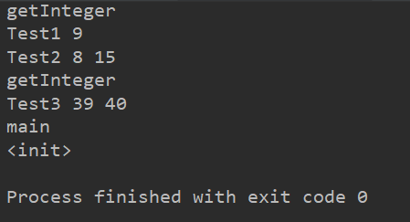
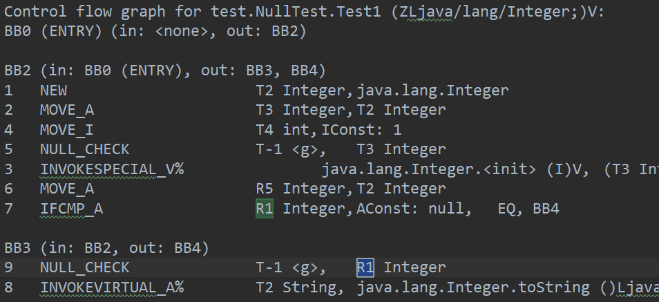
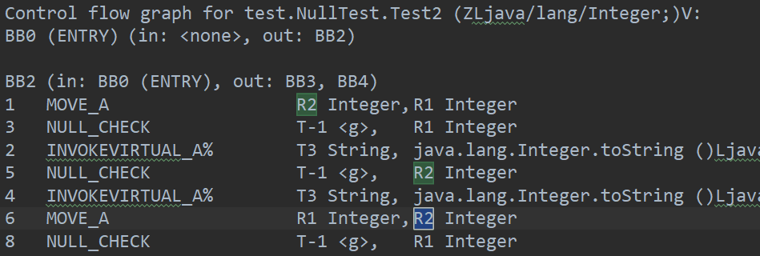
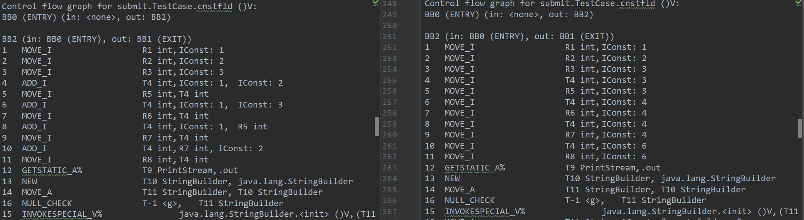
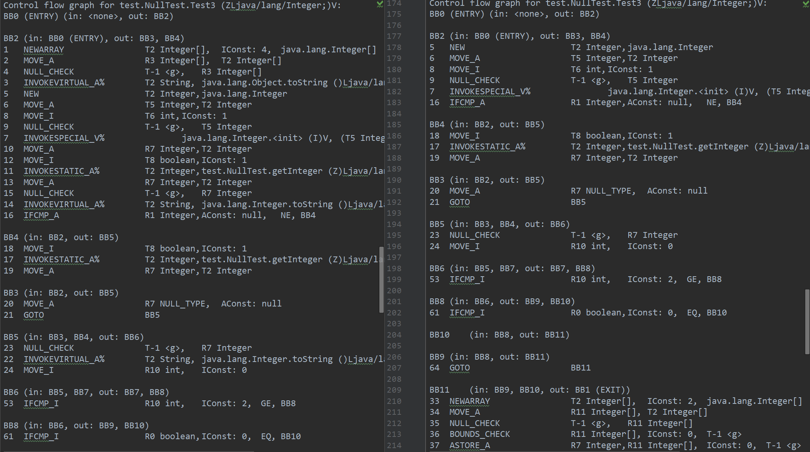

# README

> 李逸飞 2015010062

## 文件说明

新添加的源代码全部位于`src/submit`中。每种优化类型都被打包放在该目录下的一个package里。

另外添加了一个测试文件`submit.TestCase.java`，其中的测例用于开发时测试优化效果。

对于冗余 `NULL_CHECK`，添加了额外的对`IFCMP`后的非null变量检查，和对`MOVE`后的非mull变量检查。

自行添加两个额外优化：Constant Folding & Fainted Variables Elimination. 设计说明位于`submit/design.md`.

## 效果展示

### Redundant NULL_CHECK elimination (extra)

以`NullTest`为例，其结果如下：

#### IFCMP

在`Test1`的9号quad：

可见7中判断，若R1非null，则进入BB3，那么BB3中的9就无需进行`NULL_CHECK`

#### MOVE

在`Test2`的8号quad：
 
 
 
可见5已经判断R2非null，随后6将R2赋值给R1，那么R1非null，则8中的判断冗余
 
 ### Constant Folding
 
以`TestCase::cnstfld()`为例：
 
 

左边为优化前，可见大量`ADD`和`MOVE`的操作数寄存器都被替换为常量，而且`ADD`被折叠为直接赋值。
 
 ### Fainted Variables Elimination
 
以`NullTest`为例：

 

左边为优化前的中间代码，其中大量未使用过的变量、只用来为它们定值的变量，以及用于检查这些fainted variable
的`NULL_CHECK`都被消除。
